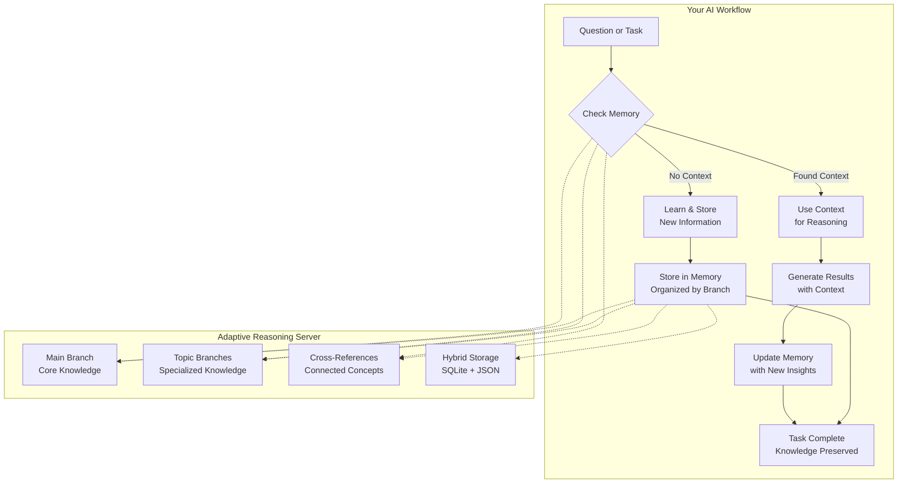

# Adaptive Reasoning Server

**A powerful MCP server that gives your AI persistent memory and adaptive reasoning capabilities.**

## Overview

The Adaptive Reasoning Server provides your AI assistant with a sophisticated memory system, allowing it to learn, reason, and recall important details about your work across conversations. Transform your AI from a stateless tool into an intelligent partner that builds knowledge over time.



## What This Does for You

| Before Adaptive Reasoning Server                 | With Adaptive Reasoning Server                                   |
| ------------------------------------------------ | ---------------------------------------------------------------- |
| AI forgets everything between conversations      | **Persistent Memory**: AI remembers your codebase and decisions |
| Must constantly re-explain project details       | **Continuous Learning**: The AI builds expertise over time       |
| No context about past work                       | **Branching Knowledge**: Organize memories by topic or project   |
| Limited understanding of project relationships   | **Smart Search**: Find related knowledge with semantic search    |

## Features

### 🌿 Branching Memory System
- **Main Branch**: Core project knowledge and long-term facts
- **Topic Branches**: Specialized knowledge areas (e.g., "authentication", "database-schema")
- **Branch Management**: Create, organize, and manage different knowledge domains

### 🔍 Smart Search & Relations
- **Semantic Search**: Find related information by meaning, not just keywords
- **Cross-References**: Automatic detection of related entities and concepts
- **Relationship Tracking**: Understand how different parts of your project connect

### 💾 Hybrid Storage
- **SQLite Database**: Fast, structured storage for entities and relations
- **JSON Backups**: Human-readable backups in `.memory/backups/`
- **Cross-Platform**: Works seamlessly on Windows, macOS, and Linux

### 📊 Knowledge Management
- **Entity Types**: Store different types of knowledge (fact, decision, pattern, insight)
- **Observations**: Add contextual notes to any entity
- **Import/Export**: Backup and restore your entire knowledge base

## Getting Started

### Installation

You can use the server via `npx` (no installation required) or install it globally:

```bash
# Option 1: Use with npx (recommended)
npx @prism.enterprises/adaptive-reasoning-server

# Option 2: Global install
npm install -g @prism.enterprises/adaptive-reasoning-server
adaptive-reasoning-server
```

### Configuration

Configure the server in your IDE's MCP settings. For Cursor, add this to `.cursor/mcp.json`:

```json
{
  "mcp": {
    "servers": {
      "adaptive-reasoning": {
        "command": "npx",
        "args": ["@prism.enterprises/adaptive-reasoning-server"],
        "env": {
          "MEMORY_PATH": "/path/to/your/project",
          "LOG_LEVEL": "info"
        }
      }
    }
  }
}
```

For Claude Desktop, add to `claude_desktop_config.json`:

```json
{
  "mcpServers": {
    "adaptive-reasoning": {
      "command": "npx",
      "args": ["@prism.enterprises/adaptive-reasoning-server"],
      "env": {
        "MEMORY_PATH": "/path/to/your/project"
      }
    }
  }
}
```

### Environment Variables

- **`MEMORY_PATH`** (required): **Your project root directory**
  - The `.memory` folder will be created at this location
  - Example: `/path/to/your/project` → creates `/path/to/your/project/.memory/`
  - Windows: `C:\Users\you\project` → creates `C:\Users\you\project\.memory\`
  - If not set, defaults to current working directory
- **`LOG_LEVEL`** (optional): Logging verbosity - `debug`, `info`, `warn`, `error` (default: `info`)

## Usage Examples

### Storing Knowledge

```typescript
// Your AI can store important facts
create_entities({
  entities: [{
    name: "API Authentication",
    entityType: "pattern",
    content: "We use JWT tokens with refresh tokens stored in httpOnly cookies",
    branch: "authentication"
  }]
})
```

### Retrieving Knowledge

```typescript
// Smart search finds relevant context
smart_search({
  query: "how does authentication work",
  limit: 5
})
```

### Branch Management

```typescript
// Create a new topic branch
create_memory_branch({
  name: "refactoring-plan",
  metadata: { purpose: "Track refactoring decisions" }
})

// List all branches
list_memory_branches()
```

## Available Tools

### Entity Management
- `create_entities` - Store new knowledge
- `delete_entities` - Remove entities
- `add_observations` - Add contextual notes
- `update_entity_status` - Modify entity status

### Search & Discovery
- `smart_search` - Semantic search across all knowledge

### Branch Operations
- `create_memory_branch` - Start a new topic branch
- `delete_memory_branch` - Remove a branch
- `list_memory_branches` - View all branches
- `read_memory_branch` - Read branch contents

## Data Storage

**Important:** Set `MEMORY_PATH` to your project root. The `.memory` folder will be created there automatically.

```
your-project/              ← Set MEMORY_PATH to this directory
├── .memory/               ← Created automatically (NOT nested)
│   ├── memory.db          ← SQLite database (primary storage)
│   ├── memory.json        ← JSON backup (legacy/backup)
│   └── backups/           ← Automatic backups
│       └── memory_backup_YYYYMMDD_HHMMSS.json
├── src/                   ← Your project files
├── package.json
└── ...
```

**Cross-Platform Paths:**
- **macOS/Linux**: `/Users/you/my-project` → `.memory` at `/Users/you/my-project/.memory/`
- **Windows**: `C:\Users\you\my-project` → `.memory` at `C:\Users\you\my-project\.memory\`

## Development

### Building from Source

```bash
# Clone the repository
git clone https://github.com/PrismAero/mcp-servers.git
cd mcp-servers

# Install dependencies
npm install

# Build
npm run build

# Watch mode for development
npm run watch
```

### Debugging

```bash
# Run in debug mode
npm run debug

# Or use the debug configuration in VS Code
```

## Contributing

Contributions are welcome! Please see [CONTRIBUTING.md](CONTRIBUTING.md) for guidelines.

## License

MIT License - see [LICENSE](LICENSE) for details.

## Credits

Developed by Kai Wyborny with advanced memory management, hybrid storage, and semantic search capabilities.  
Based on the original memory server by Anthropic, PBC.

---

**Give your AI adaptive reasoning that grows with your project.**
